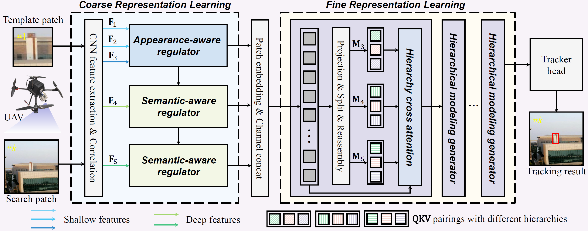

# 🏃‍♀️ PRL-Track: Progressive Representation Learning for Real-Time UAV Tracking (IROS 2024)
Changhong Fu∗, Xiang Lei, Haobo Zuo, Liangliang Yao, Guangze Zheng, and Jia Pan

\* Corresponding author.

This is the official code for the paper "Progressive Representation Learning for Real-Time UAV Tracking".



## Abstract
> Visual object tracking has significantly promoted autonomous applications for unmanned aerial vehicles (UAVs). However, learning robust object representations for UAV tracking is especially challenging in complex dynamic environments, when confronted with aspect ratio change and occlusion. These challenges severely alter the original information of the object. To handle the above issues, this work proposes a novel progressive representation learning framework for UAV tracking, i.e., PRL-Track. Specifically, PRL-Track is divided into coarse representation learning and fine representation learning. For coarse representation learning, an innovative appearance-aware regulator and a convenient semantic-aware regulator are designed to mitigate appearance interference and capture semantic information. Furthermore, for fine representation learning, a new hierarchical modeling generator is developed to intertwine coarse object representations. Exhaustive experiments demonstrate that the proposed PRL-Track delivers exceptional performance on three authoritative UAV tracking benchmarks. Real-world tests indicate that the proposed PRL-Track realizes superior tracking performance with 42.6 frames per second on the typical UAV platform equipped with an edge smart camera. The code, model, and demo videos are available at here.

## 🎞️ Video Demo 
[](https://www.youtube.com/watch?v=39lBuLESIFE "PRL-Track: Progressive Representation Learning for Real-Time UAV Tracking")

## 🛠️ Setup

### Requirements
This code has been tested on Ubuntu 18.04, Python 3.8.3, Pytorch 1.13.1, and CUDA 11.6. 

Please install related libraries before running this code:

```bash
pip install -r requirements.txt
```

## 🚀 Getting started

### Training

#### Prepare training datasets
Download the datasets：
* [COCO](http://cocodataset.org)
* [GOT-10K](http://got-10k.aitestunion.com/downloads)
* [LaSOT](http://vision.cs.stonybrook.edu/~lasot)

Note: Crop data following the instruction for [COCO](https://github.com/vision4robotics/HiFT/blob/main/training_dataset/coco/readme.md), [GOT-10k](https://github.com/vision4robotics/HiFT/blob/main/training_dataset/got10k/readme.md) and LaSOT.

Then modify the corresponding path in `pysot/core/config.py`.

```bash
python tools/train.py
```

### Testing
Download pretrained model: [PRL-Track](https://drive.google.com/drive/folders/1WYQf_zAMy9Xf1tLH1MRmQELe5ywwsB5d?usp=drive_link) and put it into `tools/snapshot` directory.

Download testing datasets and put them into `test_dataset` directory. If you want to test the tracker on a new dataset, please refer to [pysot-toolkit](https://github.com/StrangerZhang/pysot-toolkit) to set test_dataset.

```bash
python tools/test.py 
```
   
The testing result will be saved in the `results/dataset_name/tracker_name` directory, and the experimental results in our paper can be downloaded from [Google Drive](https://drive.google.com/drive/folders/1WYQf_zAMy9Xf1tLH1MRmQELe5ywwsB5d?usp=drive_link).

### Evaluation
We provide the tracking results of UAVTrack112, UAVTrack112_L, and UAV123. 

If you want to evaluate the tracker, please put those results into results directory.

```bash
python tools/eval.py
```

## Qualitative Evaluation


## Citation

If our work motivates/helps your work, please cite us as:

```bash
@inproceedings{Lei2024IROS,
  author={Fu, Changhong and Lei, Xiang and Zuo, Haobo and Yao, Liangliang and Zheng, Guangze and Pan, Jia},
  booktitle={Proceedings of the IEEE/RSJ International Conference on Intelligent Robots and Systems (IROS)}, 
  title={Progressive Representation Learning for Real-Time UAV Tracking}, 
  year={2024},
  pages={5072-5079}
}
```

## 🥰 Acknowledgments
The code is implemented based on [pysot](https://github.com/STVIR/pysot) and [HiFT](https://github.com/vision4robotics/HiFT). We would like to express our sincere thanks to the contributors.

## Contact
If you have any questions, please contact Xiang Lei at [2053932@tongji.edu.cn](2053932@tongji.edu.cn).
